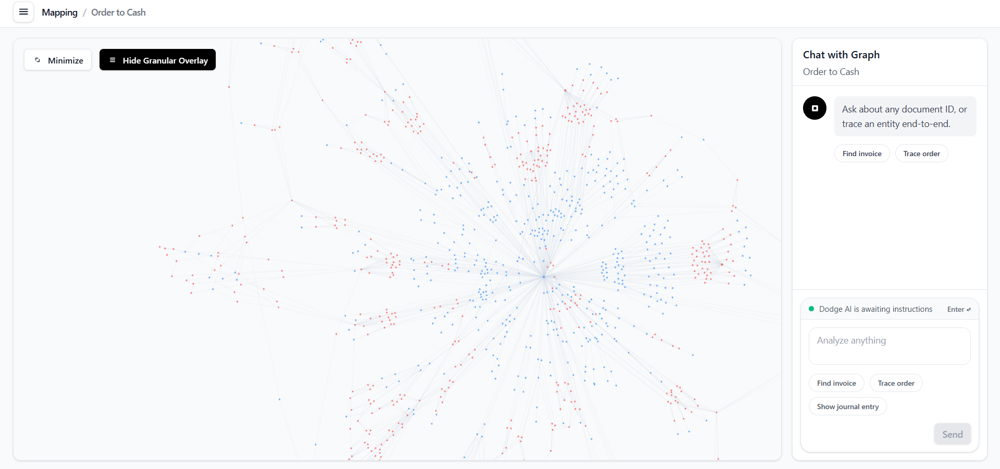
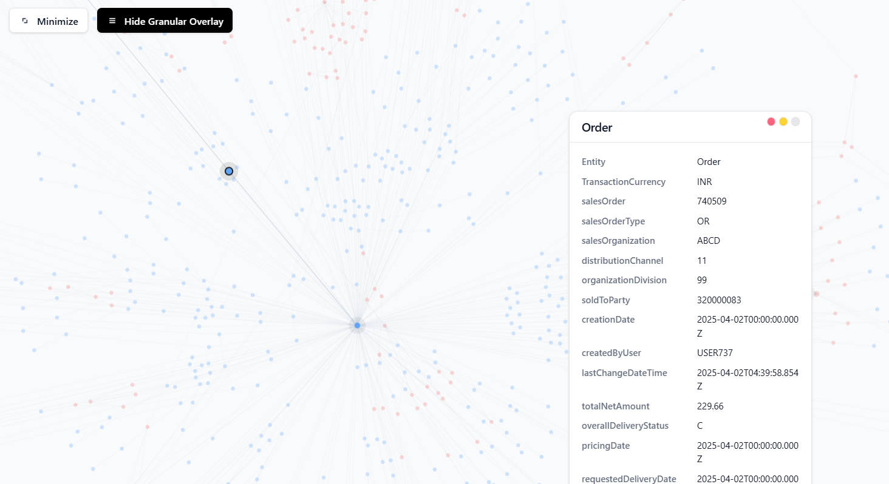
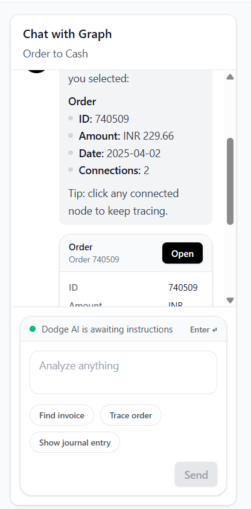

# Graph Investigator

**Graph Investigator** is a dataset-grounded investigation console for SAP-style Order-to-Cash (O2C) data—combining a high-signal graph view with evidence-first chat.

**One-line value:** trace O2C entities end-to-end, pivot across relationships instantly, and keep every answer anchored to the dataset.

---

## Overview

Order-to-Cash data is inherently graph-shaped: orders, deliveries, invoices, payments, and journal entries form multi-hop chains with frequent splits and many-to-many joins. Table-first workflows make path tracing slow and error-prone.

Graph Investigator models these relationships explicitly and provides an interface optimized for:

- **Tracing:** follow multi-hop paths without manual joins.
- **Context expansion:** inspect neighborhoods (neighbors, relationships, degree) on demand.
- **Evidence-first answers:** responses are generated from query results or deterministic dataset lookup—**no dataset hallucination**.

---

## Key Features

### Graph investigation

- Pan/zoom canvas with thin-edge, low-noise styling
- Selection focus: highlight the neighborhood and fade irrelevant context
- Floating record card with compact label/value layout for rapid scanning

### Evidence-first chat

- Structured responses (headings + bullets) with actionable follow-ups
- Evidence blocks (record cards + optional executed-query disclosure)
- Entity highlighting: nodes referenced in answers are highlighted in the graph

### Dual-mode data access (Neo4j + file fallback)

- **Neo4j mode:** traversal-heavy queries (Cypher) for deep investigations
- **File fallback mode:** deterministic operation without Neo4j; graph browsing + search + evidence cards still work

---

## System Architecture

### Components

- **Frontend (React/Vite/Tailwind)**
  - Graph canvas: `react-force-graph-2d`
  - Chat sidebar: structured answers + evidence blocks + “Open” pivots
  - Floating detail card for the selected entity
- **Backend (Node/Express)**
  - Graph APIs: `GET /api/graph`, `GET /api/node/:id`, `GET /api/search?q=...`
  - Chat pipeline: `POST /api/ask` (policy-controlled query execution with fallback)
  - Storage: Neo4j primary + deterministic file dataset fallback

### Architecture decisions (and why)

This system is optimized for analyst workflows: fast pivots, high trust, bounded cost.

- **Graph-first UI:** O2C questions are path/traversal questions. A graph canvas makes relationships inspectable without manual joins.
- **Neo4j as the primary DB (optional):** multi-hop traversals map naturally to Cypher and perform predictably on relationship-heavy datasets.
- **File fallback as a first-class mode:** deployment and onboarding should not require a database; the backend can serve the same UI contract from the dataset directory.
- **Evidence-first chat:** chat is a query-and-evidence interface, not open-ended generation; it returns structured answers plus highlights back to graph context.

### Data model (O2C)

Primary entities:

`Customer → Order → Delivery → Invoice → Payment → JournalEntry`

Stable addressing uses `entityType` + `entityId` (for example: `Invoice:91150187`).

### Data flow

1. **Graph load** → `GET /api/graph` returns `{ nodes, links }` (Neo4j or file fallback)
2. **Node select** → `GET /api/node/:id` returns node + neighbors + edges for the detail card
3. **Search** → `GET /api/search?q=...` resolves entity + id and returns the matching record and subgraph
4. **Chat ask** → `POST /api/ask`
   - Neo4j reachable: optional NL → query plan → read-only execution → evidence-first answer
   - Neo4j unreachable: deterministic dataset-backed lookup with real examples and highlights

---

## Database choice

### Why Neo4j

- O2C analysis frequently requires multi-hop traversals (invoice → payments → journal entries), neighborhood inspection, and relationship typing.
- Cypher expresses these traversals directly, reducing application-side join logic and simplifying system maintenance for path-centric workflows.

### Why file fallback

- Some environments won’t have Neo4j available (local reviews, minimal deployments).
- Fallback mode keeps the product usable and deterministic by building an in-memory graph from `DATA_DIR` while preserving the same API contracts.

### Trade-offs

- Neo4j enables traversal-heavy investigations with predictable performance but introduces operational overhead.
- File fallback is easy to deploy and deterministic but does not match Neo4j for large-scale ad hoc traversal workloads.

---

## Core Workflows

### Graph interaction

1. Click a node in the graph.
2. The UI fetches details and opens a floating card (field/value pairs).
3. The neighborhood is highlighted; unrelated context is faded for clarity.

### Chat → dataset → response

1. Ask for an entity/id (example: `Find invoice 91150187`).
2. Backend returns:
   - `answer` (structured text)
   - `highlights` (entity ids to focus in the graph)
   - `blocks` (evidence/query blocks rendered by chat)
   - `suggestions` (next actions for continued tracing)

---

## LLM prompting strategy

The LLM integration is designed as a **planning step** with strict post-validation—not an open-ended responder.

### 1) Plan generation (NL → query plan)

The backend prompts the model to return **JSON only**, typically:

- `language`: `cypher` (or `sql` when enabled)
- `query`: a single read-only query
- `params`: parameter values (no string concatenation)

Prompts are schema-aware and biased towards:

- stable identifiers (`entityType:entityId`)
- bounded result sets
- predictable shapes for UI rendering (highlights + evidence blocks)

### 2) Execution (read-only)

Plans are executed only if they pass guardrails. When execution is not possible (Neo4j down), the system falls back to deterministic dataset lookup.

### 3) Answer synthesis (results → narrative)

When query results exist, the model is prompted to produce an analyst-friendly response:

- headings and bullets
- bolded identifiers
- short relationship explanation
- optional next actions

For auditability, the UI can also disclose the executed query as a chat “query block.”

---

## Guardrails and safety controls

### Query guardrails

- **Read-only enforcement:** write operations are rejected.
- **Schema allowlists:** only dataset-relevant labels/relationships are permitted.
- **Cost bounds:** `LIMIT` clamps and execution timeouts prevent unbounded queries.
- **Procedure restrictions:** blocks risky functionality (for example, procedure calls) in generated queries.

### Grounding guarantees (no hallucination)

- If the system cannot safely execute a query, it returns deterministic dataset-backed results (or “not found” plus real examples).
- Chat responses include `highlights` to anchor the narrative to specific graph nodes.

### Degraded-mode behavior

- **Neo4j unreachable:** `POST /api/ask` falls back immediately and still returns `answer`, `highlights`, `blocks`, and `suggestions`.
- **LLM unavailable/invalid key:** the system skips LLM steps and uses deterministic dataset search instead.

---

## Tech Stack

**Frontend**
- React, Vite, Tailwind CSS
- `react-force-graph-2d`, `framer-motion`

**Backend**
- Node.js, Express, `cors`, `dotenv`

**Data**
- SAP O2C dataset loader (file-backed graph store)
- Neo4j (optional, Bolt)

**Infra**
- Frontend: Vercel
- Backend: Render

---

## Design Principles

- **Dataset integrity:** no fabricated records; answers come from results or deterministic fallback search.
- **Read-only by default:** query execution is constrained (read-only policy, schema allowlists, limit clamp, timeouts).
- **Minimal surface area:** progressive disclosure over dense controls; default workflows require few clicks.
- **Performance-aware UI:** highlight/fade behavior keeps focus on the current investigation slice.

---

## UI/UX Philosophy

Designed for analyst-grade workflows:

- **Visual hierarchy:** graph is the primary surface; chat provides narrative + evidence and guides next actions.
- **Fast pivots:** evidence blocks include “Open” actions to jump to the right context instantly.
- **Compact density:** modern B2B SaaS layout optimized for laptops (more signal, less chrome).

---

## Screenshots

**Dashboard** — graph canvas + chat sidebar with enterprise spacing and a compact header.



**Graph + Detail Card** — node selection opens a floating record card and focuses the neighborhood.



**Chat + Evidence** — structured response with evidence blocks and an “Open” pivot.



---

## Installation

Prerequisites:

- Node.js 18+
- (Optional) Neo4j with Bolt enabled

### Backend

```bash
cd backend
npm install
npm start
```

Health check:

```text
http://localhost:4000/health
```

### Frontend

```bash
cd frontend
npm install
npm run dev
```

Configure backend URL (optional):

```bash
# frontend/.env
VITE_API_BASE_URL=http://localhost:4000
```

---

## Usage

Example prompts:

- `Find invoice 91150187`
- `Get order 740509`
- `Show journal entry for 91150187`

Graph usage:

- Click any node to open the detail card.
- Use chat “Open” actions to pivot to related entities.

---

## Scalability & Performance

- **Graph payload control:** backend bounds responses to avoid unbounded edge sets.
- **Cost control:** query safety includes LIMIT clamps and timeouts.
- **UI focus:** selection-based highlighting reduces cognitive load and rendering overhead.

---

## Future Improvements

- Streaming responses (SSE) for chat to improve perceived latency
- Incremental neighborhood expansion (N hops, relationship filters)
- Saved investigations (shareable links + reproducible query context)
- Indexing/caching strategies for larger datasets and repeated pivots

---

## Contributing

Contributions are welcome. Keep changes dataset-grounded, maintain read-only safety controls, and preserve the minimal investigation workflow.

---

## License

MIT

